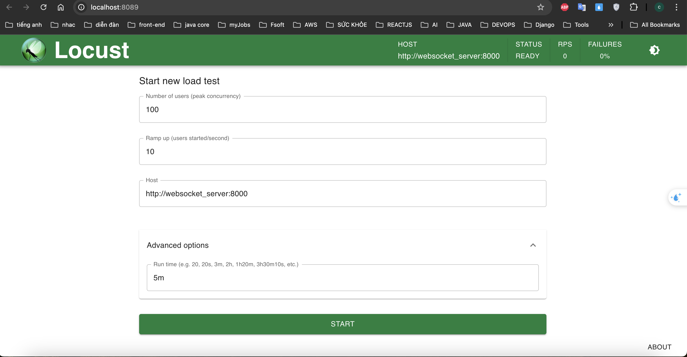
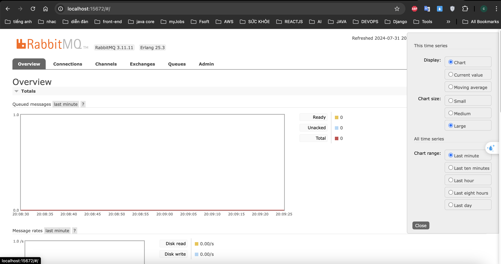

## How to Setup the Project?

#### Install Docker and docker compose

#### How to run the project locally?
- Create your .env file using .env.template
- Run the command on the terminal

```
sudo docker-compose build
```
then run command:
```
sudo docker-compose up -d
```

### How to migrate database?
- Run the command on the terminal

```commandline
alembic upgrade head
```

## Which component is importance
### WebSocket Server

#### Real-Time Communication:

```
The WebSocket server is responsible for managing real-time 
communication between clients and the server. It handles 
connections, message routing, and maintains persistent connections 
for seamless data exchange, which is essential for any real-time 
application like chat or live notifications.
```

#### Connection Management:
```
It manages the lifecycle of client connections, including connection 
establishment, maintenance (through heartbeats), and disconnection. 
This component ensures that each client can only connect once and 
that the maximum number of concurrent connections is respected.
```

#### Message Processing and Routing:
```
The WebSocket server is the first point of contact for all client
 messages. It validates and routes messages to the appropriate 
 handlers or queues for further processing, including pushing 
 messages to RabbitMQ for asynchronous handling.
```

#### Scalability and Performance
```
The WebSocket server's efficiency and reliability directly impact 
the system's ability to scale and handle multiple users concurrently.
 Poor performance here can lead to high latency, dropped messages, 
 and a degraded user experience.
```

#### User Experience:
```
```As the component directly interacting with clients, the WebSocket
 server plays a crucial role in the user experience. It provides 
 immediate feedback to users, such as message delivery status, 
 which is vital for a responsive application.

```

### How can run test:

#### Access http://localhost:8089/
Setup new load test, click **Start**



### Access http://localhost:15672/
Check the message send to queue
